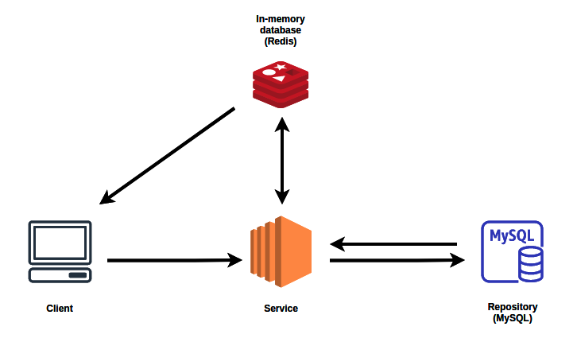

# Overview

URL Shortener is a simple application that is used to shorten long URLs. A URL shortener is useful in the cases where you have long URLs that have sensitive pieces of information and you want to hide that from the service you are sharing the URLs with. 

## Architecture

### Layers
- `Service` - Service Layer where the business logic of the shortening service persists. The code is written using SpringBoot 2.5.
- `Repository`- Repository Layer where the URLs along with their shortened hash is persisted. Backed by MySQL with JPA. 
- `In-memory Database` - An in-memory store that acts as a cache. It is used to store the SQL objects for faster access. Backed by Redis with Redisson client.

